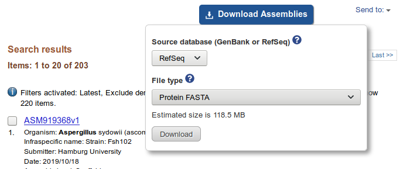

# clusterblaster
[](https://travis-ci.org/gamcil/clusterblaster)
[](https://coveralls.io/github/gamcil/clusterblaster?branch=master)
[](https://opensource.org/licenses/MIT)
[](https://badge.fury.io/py/clusterBLASTer)

`clusterblaster` is a tool for finding clusters of co-located homologous sequences
in BLAST searches.

## Outline
1. Perform BLAST search, remotely (via BLAST API) or locally (via `diamond`)
2. Parse results, save hits meeting user-defined thresholds for identity, coverage and
   e-value
3. Query the Identical Protein Group (IPG) resource to fetch the position of each hit on
   their respective genomic scaffolds
4. Look for clusters of co-located hits meeting thresholds for intergenic distance and
   minimum number of conserved sequences

## Installation
`clusterblaster` can be installed via pip:

```bash
~$ pip3 install clusterblaster --user
```

or by cloning the repository and installing:

```bash
~$ git clone https://github.com/gamcil/clusterblaster.git
...
~$ cd clusterblaster/
~$ pip3 install .
```

## Dependencies
`clusterblaster` is tested on Python 3.6, and its only external Python dependency is
the `requests` module (used for interaction with NCBI APIs).
If you want to perform local searches, you should have `diamond` installed and available
on your system $PATH.
`clusterblaster` will throw an error if a local search is started but it cannot find
`diamond` or `diamond-aligner` (alias when installed via apt) on the system.

## Usage
`clusterblaster` accepts FASTA files and collections of valid NCBI sequence identifiers
(GIs, accession numbers) as input.
There are two search modes, specified by the `--mode` argument.
By default (i.e. `--mode` not given), it will be set to `remote`, which will launch a
remote BLAST search using NCBI's BLAST API.
Alternatively, `local` mode performs a search against a local `diamond` database, which
is much quicker (albeit requires some initial setup).

### Performing a remote search via the NCBI BLAST API
At a minimum, a search could look like one of the following:

```bash
~$ cblaster -qf query.fasta 
~$ cblaster -qi QBE85649.1 QBE85648.1 QBE85647.1 QBE85646.1 ...
```

This will launch a remote search against the non-redundant (nr) protein database,
retrieve and parse the results, then report any blocks of hits to the terminal.
By default, hits are only reported if they are above 30% percent identity and 50% query
coverage, and have an e-value below 0.01.
If we wanted to be stricter, we could change those values with the following:

```bash
~$ cblaster -qf query.fasta --min_identity 70 --min_coverage 90 --evalue 0.001
```

You can also pass in NCBI search queries using `-eq / --entrez_query` to pre-filter
the target database, which can result in vastly reduced run-times and more
targeted results. For example, to only search against *Aspergillus* sequences:

```bash
~$ cblaster -qf query.fasta --entrez_query "Aspergillus"[ORGN]
```

Look [here](https://www.ncbi.nlm.nih.gov/books/NBK49540/) for a full description of
Entrez search terms.

### Searching a local database using DIAMOND
Alternatively, a local DIAMOND database can be searched by specifying:

```bash
~$ cblaster -qf query.fasta --mode local --database db.dmnd
```

For this to work, the database must consist of sequences derived from NCBI, such that
their identifiers can be used for retrieval of sequences/genomic context.
The easiest way to set this up is via NCBI's batch assembly download option.
For example, to build a database of *Aspergillus* protein sequences:

1. Search the NCBI Assembly database for *Aspergillus* genomes


2. Click 'Download Assemblies', select 'Protein FASTA' and click 'Download'



3. Extract all FASTA files and concatenate them

```bash
~$ pigz -d *.gz
~$ cat *.faa >> proteins.faa
```

4. Build the DIAMOND database

```bash
~$ diamond makedb --in proteins.faa --db proteins
...
~$ ls
database.faa
database.dmnd
```

5. Run `clusterblaster` against the newly created databse

```bash
~$ cblaster -m diamond -qf query.fa -db database.dmnd <options>
```

Alternatively, you could use
[`ncbi-genome-download`](https://github.com/kblin/ncbi-genome-download)
to retrieve the sequences from the command line.


## Citation
If you found this tool useful, please cite:

```
1. Buchfink, B., Xie, C. & Huson, D. H. Fast and sensitive protein alignment using DIAMOND. Nat. Methods 12, 59–60 (2015).
2. Acland, A. et al. Database resources of the National Center for Biotechnology Information. Nucleic Acids Res. 42, 7–17 (2014).
```
